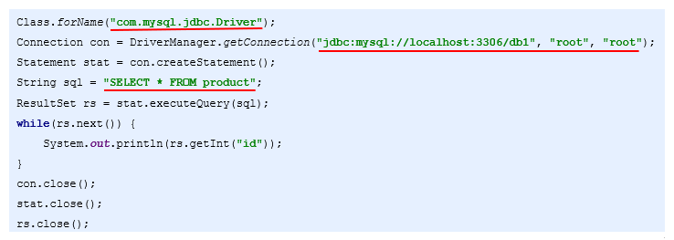
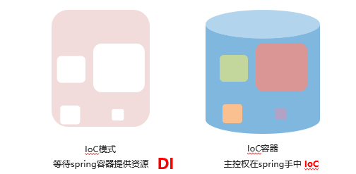

# Spring学习笔记

## IoC

### IoC简介

### 2.1)优质程序代码的制作原则



### 2.2)耦合与内聚

- 耦合（Coupling）：代码书写过程中所使用技术的结合紧密度，用于衡量软件中各个模块之间的互联程度

- 内聚（Cohesion）：代码书写过程中单个模块内部各组成部分间的联系，用于衡量软件中各个功能模块内部的功能联系


- 程序书写的目标：高内聚，低耦合
  - 就是同一个模块内的各个元素之间要高度紧密，但是各个模块之间的相互依存度却不要那么紧密

### 2.3)工厂模式发展史


### 2.4)Spring发展历程


### 2.5)IoC

- IoC（Inversion Of Control）控制反转，Spring反向控制应用程序所需要使用的外部资源

- Spring控制的资源全部放置在Spring容器中，该容器称为IoC容器

  


### 入门案例

### 3.1)案例环境说明

- 模拟三层架构中表现层调用业务层功能

  - 表现层：UserApp模拟UserServlet（使用main方法模拟）

  - 业务层：UserService

### 3.2)IoC入门案例制作步骤

1.导入spring坐标（5.1.9.release）

2.编写业务层与表现层（模拟）接口与实现类

3.建立spring配置文件

4.配置所需资源（Service）为spring控制的资源

5.表现层（App）通过spring获取资源（Service实例）


#### 3.2.1)IoC入门案例制作步骤-1

```xml
<dependency>
    <groupId>org.springframework</groupId>
    <artifactId>spring-context</artifactId>
    <version>5.1.9.RELEASE</version>
</dependency>
```

#### 3.2.2)IoC入门案例制作步骤-2

```java
public interface UserService {
	//业务方法  
	void save();
}
```

#### 3.2.3)IoC入门案例制作步骤-3

```java
public class UserServiceImpl implements UserService {
    public void save() {
        System.out.println("user service running...");
    }
}
```

#### 3.2.4)IoC入门案例制作步骤-4

```xml
<?xml version="1.0" encoding="UTF-8"?>
<beans xmlns="http://www.springframework.org/schema/beans"
       xmlns:xsi="http://www.w3.org/2001/XMLSchema-instance"
       xsi:schemaLocation="http://www.springframework.org/schema/beans
        https://www.springframework.org/schema/beans/spring-beans.xsd">
    <!-- 1.创建spring控制的资源-->
    <bean id="userService" class="com.itheima.service.impl.UserServiceImpl"/>
</beans>
```

#### 3.2.5)IoC入门案例制作步骤-5

```java
public class UserApp {
    public static void main(String[] args) {
        //2.加载配置文件
        ApplicationContext ctx = new ClassPathXmlApplicationContext("applicationContext.xml");
        //3.获取资源
        UserService userService = (UserService) ctx.getBean("userService");
        userService.save();
    }
}
```

### 4)IoC配置（XML格式）

### 4.1)bean

- 名称：bean

- 类型：**标签**

- 归属：beans标签

- 作用：定义spring中的资源，受此标签定义的资源将受到spring控制

- 格式：

  ```xml
  <beans>
  	<bean />
  </beans>
  ```

- 基本属性：

  ```xml
  <bean id="beanId" name="beanName1,beanName2" class="ClassName"></bean>
  ```

  ​	id：bean的名称，通过id值获取bean

  ​	class：bean的类型

  ​	name：bean的名称，可以通过name值获取bean，用于多人配合时给bean起别名

### 4.2)bean属性scope

- 名称：scope

- 类型：**属性**

- 归属：bean标签

- 作用：定义bean的作用范围

- 格式：

  ```xml
  <bean scope="singleton"></bean>
  ```

- 取值：

  - singleton：设定创建出的对象保存在spring容器中，是一个单例的对象
  - prototype：设定创建出的对象保存在spring容器中，是一个非单例的对象
  - request、session、application、 websocket ：设定创建出的对象放置在web容器对应的位置

### 4.3)bean生命周期

- 名称：init-method，destroy-method

- 类型：**属性**

- 归属：bean标签

- 作用：定义bean对象在初始化或销毁时完成的工作

- 格式：

  ```xml
  <bean init-method="init" destroy-method="destroy></bean>
  ```

- 取值：bean对应的类中对应的具体方法名

- 注意事项：

  - 当scope=“singleton”时，spring容器中有且仅有一个对象，init方法在创建容器时仅执行一次

  - 当scope=“prototype”时，spring容器要创建同一类型的多个对象，init方法在每个对象创建时均执行一次

  - 当scope=“singleton”时，关闭容器会导致bean实例的销毁，调用destroy方法一次

  - 当scope=“prototype”时，对象的销毁由垃圾回收机制gc()控制，destroy方法将不会被执行

### 4.4)bean对象创建方式（了解）

(1)factory-bean

- 名称：factory-bean

- 类型：**属性**

- 归属：bean标签

- 作用：定义bean对象创建方式，使用静态工厂的形式创建bean，兼容早期遗留系统的升级工作

- 格式：

  ```xml
  <bean class="FactoryClassName" factory-method="factoryMethodName"></bean>
  ```

- 取值：工厂bean中用于获取对象的静态方法名

- 注意事项：

  - class属性必须配置成静态工厂的类名

(2)factory-bean，factory-method

- 名称：factory-bean，factory-method

- 类型：**属性**

- 归属：bean标签

- 作用：定义bean对象创建方式，使用实例工厂的形式创建bean，兼容早期遗留系统的升级工作

- 格式：

  ```xml
  <bean factory-bean="factoryBeanId" factory-method="factoryMethodName"></bean>
  ```

- 取值：工厂bean中用于获取对象的实例方法名

- 注意事项：

  - 使用实例工厂创建bean首先需要将实例工厂配置bean，交由spring进行管理

  - factory-bean是实例工厂的beanId

```
ClassPathXmlApplicationContext
```

### 	4.5)DI

- IoC（Inversion Of Control）控制翻转，Spring反向控制应用程序所需要使用的外部资源

- DI（Dependency Injection）依赖注入，应用程序运行依赖的资源由Spring为其提供，资源进入应用程序的方式称为注入



IoC与DI的关系

- IoC与DI是同一件事站在不同角度看待问题

- 半杯水

  

### 4.6)set注入（主流）

- 名称：property

- 类型：**标签**

- 归属：bean标签

- 作用：使用set方法的形式为bean提供资源

- 格式：

  ```java
  <bean>
  	<property />
  </bean>
  ```

- 基本属性：

  ```xml
  <property name="propertyName" value="propertyValue" ref="beanId"/>
  ```

​	name：对应bean中的属性名，要求该属性必须提供可访问的set方法（严格规范为此名称是set方法对应名称）

​	value：设定非引用类型属性对应的值，不能与ref同时使用

​	ref：设定引用类型属性对应bean的id ，不能与value同时使用

- 注意：一个bean可以有多个property标签

### 4.7)构造器注入（了解）

- 名称：constructor-arg

- 类型：**标签**

- 归属：bean标签

- 作用：使用构造方法的形式为bean提供资源，兼容早期遗留系统的升级工作

- 格式：

  ```xml
  <bean>
  	<constructor-arg />
  </bean>
  ```

- 基本属性：

  ```xml
  <constructor-arg name="argsName" value="argsValue />
  ```

​	name：对应bean中的构造方法所携带的参数名

​	value：设定非引用类型构造方法参数对应的值，不能与ref同时使用

其他属性：

```xml
<constructor-arg index="arg-index" type="arg-type" ref="beanId"/>
```

​	ref：设定引用类型构造方法参数对应bean的id ，不能与value同时使用

​	type ：设定构造方法参数的类型，用于按类型匹配参数或进行类型校验

​	index ：设定构造方法参数的位置，用于按位置匹配参数，参数index值从0开始计数

- 注意：一个bean可以有多个constructor-arg标签

### 4.8)集合类型数据注入

- 名称：array，list，set，map，props

- 类型：**标签**

- 归属：property标签 或 constructor-arg标签

- 作用：注入集合数据类型属性

- 格式：

  ```xml
  <property>
  	<list></list>
  </property>
  ```

(1)集合类型数据注入——list

```xml
<property name="al">
    <list>
        <value>itheima</value>
        <value>66666</value>
    </list>
</property>
```

(2)集合类型数据注入——props

```xml
<property name="properties">
    <props>
        <prop key="name">itheima666</prop>
        <prop key="value">666666</prop>
    </props>
</property>
```

(3)集合类型数据注入——array （了解）

```xml
<property name="arr">
    <array>
        <value>123456</value>
        <value>66666</value>
    </array>
</property>
```

(4)集合类型数据注入——set（了解）

```xml
 <property name="hs">
     <set>
         <value>itheima</value>
         <value>66666</value>
     </set>
</property>
```

(5)集合类型数据注入——map（了解）

```xml
<property name="hm">
    <map>
        <entry key="name" value="itheima66666"/>
        <entry key="value" value="6666666666"/>
    </map>
</property>
```

### 4.9)使用p命名空间简化配置（了解）

- 名称：p:propertyName，p:propertyName-ref

- 类型：**属性**

- 归属：bean标签

- 作用：为bean注入属性值

- 格式：

  ```xml
  <bean p:propertyName="propertyValue" p:propertyName-ref="beanId"/>
  ```

- 注意：使用p命令空间需要先开启spring对p命令空间的的支持，在beans标签中添加对应空间支持

  ```xml
  <beans xmlns="http://www.springframework.org/schema/beans"    xmlns:xsi="http://www.w3.org/2001/XMLSchema-instance"    xmlns:p="http://www.springframework.org/schema/p"       xsi:schemaLocation="http://www.springframework.org/schema/beans     https://www.springframework.org/schema/beans/spring-beans.xsd">
  ```

  后续课程中还将开启其他的命名空间，方式同上

- 案例：

  ```xml
   <bean
         id="userService"
         class="com.itheima.service.impl.UserServiceImpl"
         p:userDao-ref="userDao"
         p:bookDao-ref="bookDao"
         />
  ```

  